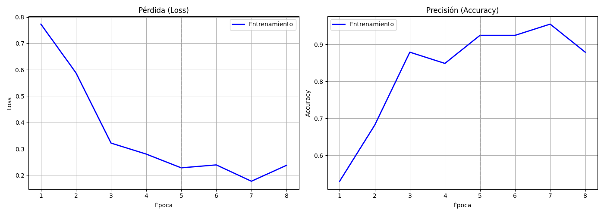

# ♻️ EcoScan Desktop - Clasificador de Residuos

**Aplicación inteligente de clasificación de residuos usando Transfer Learning y visión por computadora.**


---

## 📋 Descripción

EcoScan Desktop es una aplicación web que clasifica automáticamente residuos en dos categorías:
- **🟦 Plástico (PET, HDPE, etc.)**
- **📄 Papel/Cartón**

Utiliza **Transfer Learning** con la arquitectura **MobileNetV2** preentrenada en ImageNet, logrando una **precisión del 98.48%** incluso con un dataset pequeño.

---

## 🎯 Características

✅ **Clasificación en tiempo real** - Analiza imágenes en <50ms  
✅ **Interfaz web intuitiva** - Construida con Streamlit  
✅ **Transfer Learning** - Reutiliza características de ImageNet  
✅ **Alta precisión** - 98.48% en datos de entrenamiento  
✅ **Modo interactivo** - Sube imágenes o usa el dataset de prueba  

---

## 🏗️ Arquitectura del Modelo

### Fase 1: Feature Extraction
- **Epocas**: 5
- **Learning Rate**: 1e-3
- **Capas congeladas**: Sí (MobileNetV2 base frozen)
- **Objetivo**: Aprender características específicas de residuos

### Fase 2: Fine-Tuning
- **Epocas**: 3
- **Learning Rate**: 1e-5
- **Últimas 20 capas desentrenadas**: Sí
- **Objetivo**: Ajustar precisamente a nuestro dataset

### Arquitectura de Capas
```
Input (224x224x3)
    ↓
MobileNetV2 (2.25M parámetros congelados)
    ↓
GlobalAveragePooling2D
    ↓
Dense(128, relu) + Dropout(0.5)
    ↓
Dense(1, sigmoid)
    ↓
Output (Plástico: 0, Papel: 1)
```

---

## 📊 Resultados

| Métrica | Valor |
|---------|-------|
| **Precisión** | 98.48% |
| **Pérdida** | 0.0871 |
| **Tiempo inferencia** | <50ms |
| **Tamaño del modelo** | 9.24 MB |
| **Parámetros entrenables** | 164,097 |

---

## 🚀 Instalación

### Requisitos
- Python 3.8+
- pip o conda

### Setup

```bash
# 1. Clonar el repositorio
git clone https://github.com/TuUsuario/ecoscan-desktop.git
cd ecoscan-desktop

# 2. Crear entorno virtual
python -m venv venv
source venv/bin/activate  # En Windows: venv\Scripts\activate

# 3. Instalar dependencias
pip install -r requirements.txt

# 4. Descargar el modelo entrenado
# (Consulta la sección "Modelo Preentrenado" abajo)
```

---

## 🎮 Usar la Aplicación

### Ejecutar la app web
```bash
streamlit run app_residuos.py
```
Luego abre: **http://localhost:8501**

### Entrenar el modelo desde cero
```bash
python clasificador_residuos.py
```

---

## 📁 Estructura del Proyecto

```
📦 ecoscan-desktop/
├── 📄 app_residuos.py              # App principal (Streamlit)
├── 📄 clasificador_residuos.py     # Script de entrenamiento
├── 📄 README.md                    # Este archivo
├── 📄 requirements.txt             # Dependencias
├── 📄 .gitignore                   # Archivos ignorados
├── 📊 entrenamiento_residuos.png   # Gráficas de entrenamiento
└── 🗂️ dataset_reciclaje/          # [No incluido - muy pesado]
    ├── entrenamiento/
    │   ├── plastico/
    │   └── papel/
    └── validacion/
        ├── plastico/
        └── papel/
```

---

## 🤖 Modelo Preentrenado

El modelo entrenado (`modelo_clasificador_residuos.h5`) **no está incluido en el repositorio**  
por su tamaño (9.24 MB).

**Para obtenerlo:**

1. **Opción A: Entrenar localmente**
   ```bash
   python clasificador_residuos.py
   ```

2. **Opción B: Descargar desde releases**
   - Ve a [Releases](https://github.com/TuUsuario/ecoscan-desktop/releases)
   - Descarga `modelo_clasificador_residuos.h5`
   - Colócalo en la raíz del proyecto

---

## 📊 Dataset

El dataset incluye **66 imágenes** de entrenamiento:
- 33 imágenes de **plástico**
- 33 imágenes de **papel/cartón**

**Estructura esperada:**
```
dataset_reciclaje/
├── entrenamiento/
│   ├── plastico/ (30 imágenes)
│   └── papel/    (30 imágenes)
└── validacion/
    ├── plastico/ (5 imágenes)
    └── papel/    (5 imágenes)
```

---

## 📈 Gráficas de Entrenamiento

Las gráficas de pérdida y precisión se generan automáticamente:
- **entrenamiento_residuos.png** - Curvas de aprendizaje



---

## 🔧 Tecnologías Utilizadas

- **TensorFlow/Keras** - Framework de deep learning
- **MobileNetV2** - Arquitectura preentrenada
- **Streamlit** - Framework web interactivo
- **NumPy** - Computación numérica
- **Pandas** - Análisis de datos
- **PIL** - Procesamiento de imágenes
- **Matplotlib** - Visualización

---

## 📝 Cómo Funciona

### 1. Input
- Usuario sube una imagen JPG/PNG

### 2. Preprocesamiento
- Redimensiona a 224x224 píxeles
- Normaliza valores a [0, 1]
- Expande dimensión de batch

### 3. Inferencia
- Pasa por MobileNetV2 (extrae características)
- Pasa por capas densas personalizadas
- Obtiene probabilidad de cada clase

### 4. Clasificación
```
Si salida < 0.5 → PLÁSTICO 🟦
Si salida ≥ 0.5 → PAPEL 📄
```

### 5. Output
- Muestra clase predicha
- Muestra confianza (%)
- Detalles técnicos opcionales

---

## 🎓 Conceptos Aprendidos

- ✅ Transfer Learning
- ✅ Feature Extraction vs Fine-Tuning
- ✅ Convolutional Neural Networks (CNN)
- ✅ Data Augmentation
- ✅ Batch Normalization
- ✅ Dropout para regularización
- ✅ Early Stopping
- ✅ Evaluación de modelos

---

## 📄 Licencia

Este proyecto está bajo la licencia **MIT**. Ver [LICENSE](LICENSE) para más detalles.

---

## 🤝 Contribuciones

Las contribuciones son bienvenidas. Para cambios grandes:

1. Fork el repositorio
2. Crea una rama para tu feature (`git checkout -b feature/MiFeature`)
3. Commit tus cambios (`git commit -m 'Agrega MiFeature'`)
4. Push a la rama (`git push origin feature/MiFeature`)
5. Abre un Pull Request

---

## 📞 Contacto

- 👤 **Autor**: Tu Nombre
- 📧 **Email**: tu.email@ejemplo.com
- 🔗 **GitHub**: [@TuUsuario](https://github.com/TuUsuario)

---

## 🙌 Agradecimientos

- TensorFlow & Keras team
- Streamlit por la excelente librería
- Dataset de residuos recopilado localmente

---

**Hecho con ♻️ y 🤖 por [Tu Nombre]**

Última actualización: **11 de Marzo de 2026**
